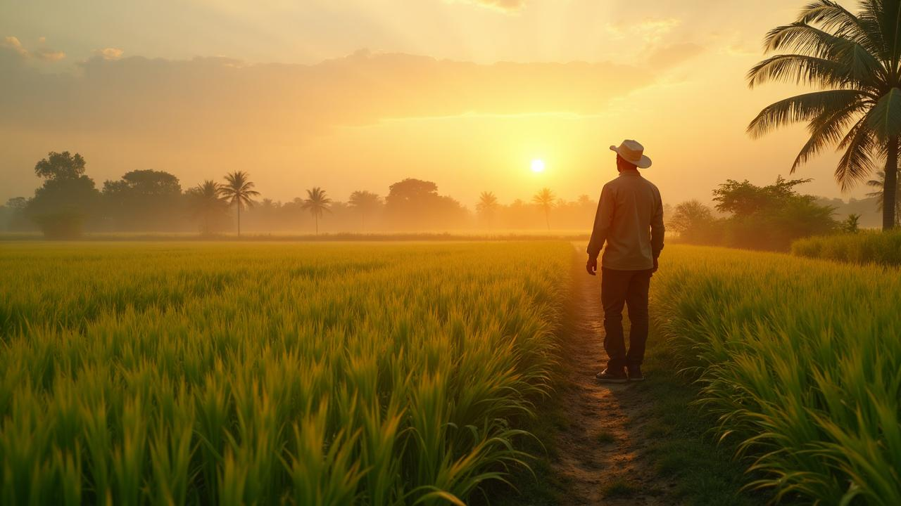
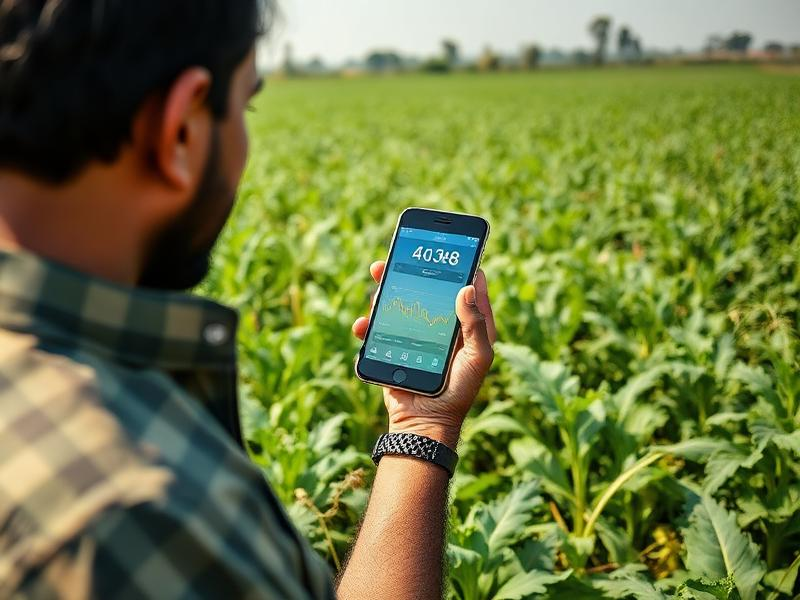
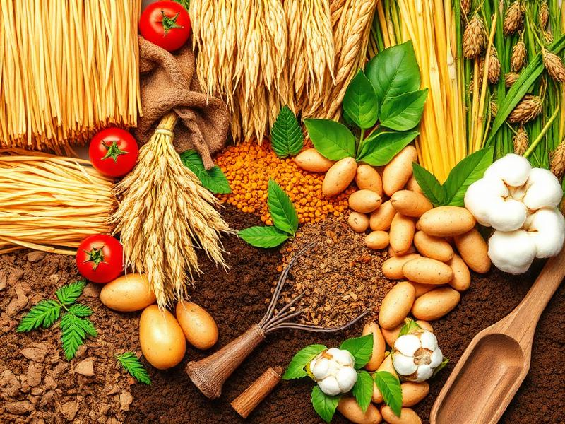

# Krishi AI Project

This is my AI-based agriculture project.
<div align="center">
  
  
  # 🌱 Krishi-AI 
  ### *Smart Agriculture Solutions for Maharashtra*

  <p>
    An intelligent, multilingual web platform empowering farmers with AI-driven crop recommendations, real-time market data, and predictive weather advisories.
  </p>

  <p>
    <a href="#-key-features">Features</a> •
    <a href="#-tech-stack">Tech Stack</a> •
    <a href="#%EF%B8%8F-getting-started">Installation</a> •
    <a href="#-architecture--localization">Architecture</a>
  </p>
</div>

---

<div align="center">
  
</div>

## 🌟 Overview

**Krishi-AI** is a comprehensive digital platform designed to bridge the gap between traditional Indian farming and modern artificial intelligence. Specifically tailored for the state of **Maharashtra**, the system helps farmers maximize yield and profit by making data-driven decisions based on soil health, local climate, and APMC market trends.

The application is built with a **"Mobile-First"** approach to ensure seamless accessibility on rural smartphones and features a robust 3-way localization engine (English, Marathi, and Hindi), defaulting to the native Marathi language for maximum inclusivity.

<div align="center">
  
  
</div>

## ✨ Key Features

*   **🤖 AI Soil Analysis & Crop Recommendation**
    *   Upload soil photos or input manual data (pH, Moisture, NPK levels).
    *   Machine learning models predict the most profitable and suitable crop for specific districts (e.g., Nagpur Oranges, Vidarbha Cotton).
*   **🩺 Crop Disease Detection**
    *   Computer vision integration to identify plant diseases from uploaded leaf/stem photos and provide immediate treatment protocols.
*   **📊 Real-Time APMC Market Prices**
    *   Live tracking of *Mandi* (Market) prices across all 36 districts of Maharashtra, empowering farmers to sell for the highest profit margin.
*   **🌤️ Predictive Weather Advisories**
    *   5-day hyper-local forecasts integrated with agricultural warnings (e.g., suggesting early harvest due to incoming rain).
*   **🌍 Triple-Localization Engine**
    *   Full state-contextualized translations in **Marathi (Default)**, Hindi, and English using `react-i18next`.

## 🚀 Tech Stack

**Frontend Framework & UI**
*   **React 18** (Functional Components, Custom Hooks)
*   **TypeScript** (Strict Type-Safety)
*   **Vite** (Next-Generation Frontend Tooling for rapid HMR and optimized builds)
*   **Tailwind CSS** (Utility-first CSS for responsive, mobile-first design)
*   **Shadcn/UI** (Accessible, customizable Radix UI components)
*   **Lucide React** (Consistent iconography)

**State Management & Utilities**
*   **React Router DOM** (Client-side routing)
*   **i18next & react-i18next** (Dynamic i18n localization)
*   **clsx & tailwind-merge** (Dynamic styling utilities)

## 🛠️ Getting Started

### Prerequisites

*   Node.js (v18.0 or higher)
*   npm or yarn

### Installation

1.  **Clone the repository**
    ```sh
    git clone https://github.com/yourusername/krishi-ai.git
    cd krishi-ai
    ```

2.  **Install dependencies**
    ```sh
    npm install
    ```

3.  **Start the development server**
    ```sh
    npm run dev
    ```
    *The app will be running at `http://localhost:5173`.*

4.  **Production Build**
    ```sh
    npm run build
    npm run preview
    ```

## 🏗️ Architecture & Localization

Krishi-AI is engineered for scalability and high performance in low-bandwidth areas:
*   **Component Modularity:** UI is strictly separated into abstract, reusable components (`src/components/ui`) and feature-heavy domain components (`src/components/results`, `src/components/forms`).
*   **Dynamic Translation Dictionary:** Localization maps (`src/locales/en.json`, `mr.json`, `hi.json`) allow for instant language switching without page reloads. The application defaults to Marathi to serve its target demographic efficiently.
*   **Mobile Responsiveness:** Intensive grid and flexbox utility usage ensures the dashboard is fully accessible on extra-small mobile viewports (down to `375px` width), replicating a native-app experience via mobile bottom-navigation menus.

## 🤝 Contributing

We welcome contributions from developers, agronomists, and UI/UX designers! If you have suggestions to improve the AI models, add new district data, or enhance the UI, please open a pull request.

---
<div align="center">
  <i>Empowering Maharashtra's Agriculture through Artificial Intelligence</i>
</div>
